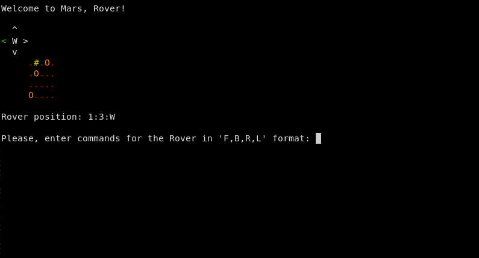

# mars-rover-kata

This is a "game" inspired by the mars rover kata for Scala:

https://github.com/doubleloop-io/applied-fp-workshop-scala/blob/main/marsroverkata/TODO.md

My goal was to learn [Effect-TS](https://github.com/Effect-TS/core) and have some fun along the way.

Here is where I landed:

## Installation

Execute `nix-shell` directly or install `direnv`.

Then: `pnpm install`

## Description

https://github.com/doubleloop-io/applied-fp-workshop-scala/blob/main/marsroverkata/TODO.md

Offline copy at: `description.md`

## Testing

`pnpm t`

`pnpm t -- --watch`

`pnpm exec jest --watch`

## Building

`pnpm run build`

Watch mode:

`pnpm run build -- -w`

## Running

`pnpm run app`

## Misc

`pnpm clean`

## Docker (if you need it)

`docker-compose run mac nix-shell --run 'pnpm test'`

Watch mode:

`docker-compose run mac nix-shell --run 'pnpm test -- --watch'`
